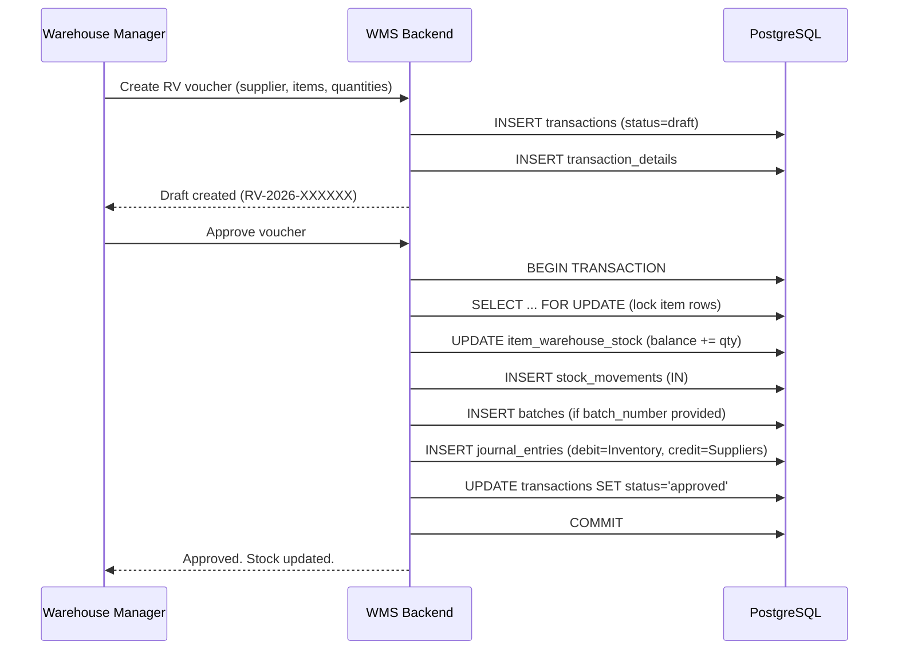
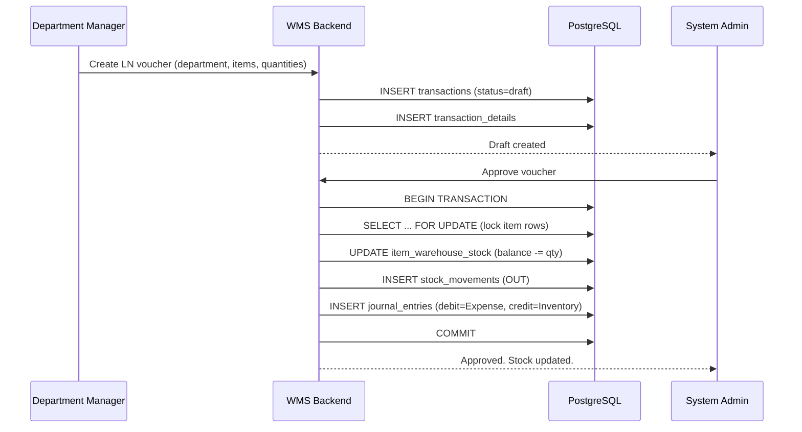
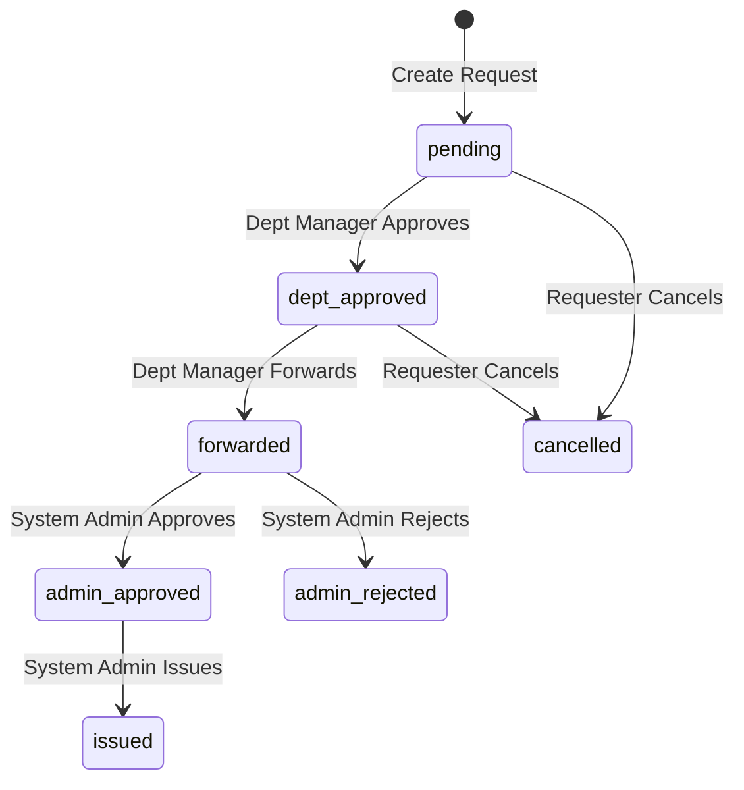
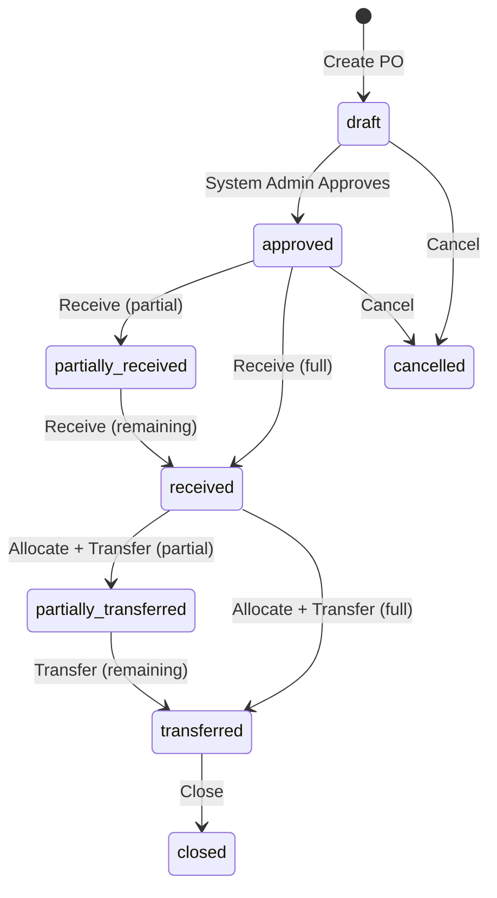
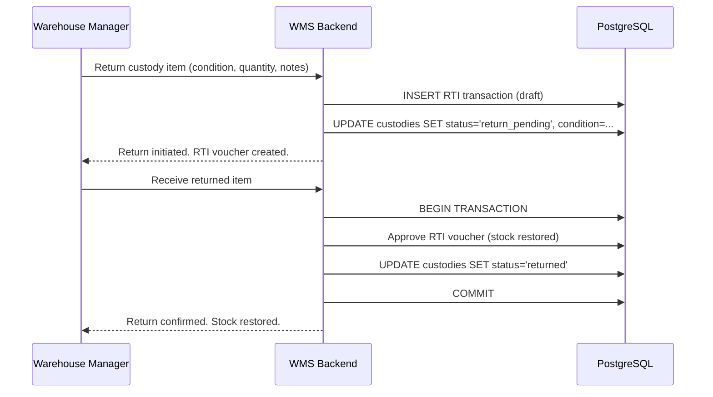
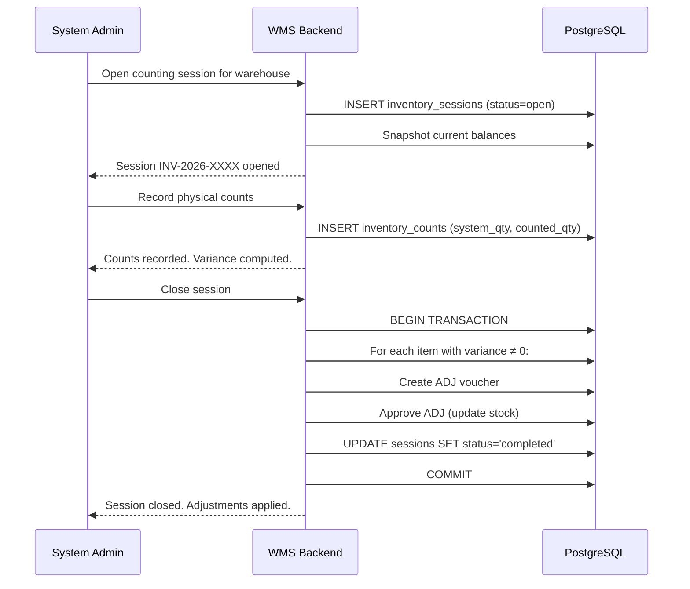
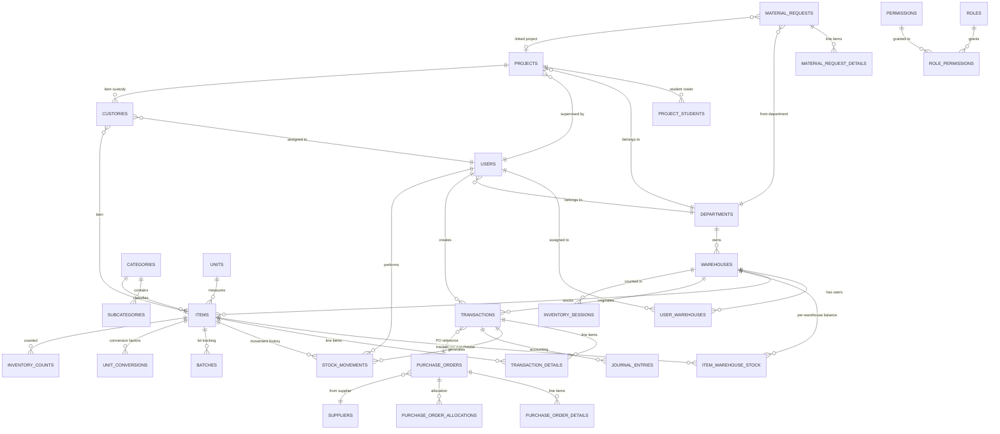

# Warehouse Management System — Project Discovery

## 1. Executive Summary

This document captures the business discovery, requirements analysis, and architectural baseline for the Warehouse Management System (WMS). The system is an integrated, bilingual (Arabic/English) platform for end-to-end warehouse operations — receiving, issuing, transferring, cycle counting, procurement, material requests, custody tracking, and graduation-project inventory management — designed for institutional and academic environments.

The system has a mature implementation comprising 22 backend modules, 27 frontend pages, 33+ database tables, 36 schema migrations, 152 automated tests, and a full RBAC authorization framework with 53 atomic permissions. This document serves as the authoritative source of truth for the business problem, scope, requirements, workflows, data model, and open questions.

---

## 2. Problem Statement

### 2.1 Core Business Problem

Institutional warehouses (universities, research centers, manufacturing facilities) operate across multiple departmental sub-warehouses and face recurring operational pain points:

| Problem | Impact |
|---------|--------|
| **Inventory blindness** — No real-time view of stock levels across warehouses. | Stockouts, over-ordering, wasted procurement budget. |
| **Paper-based or spreadsheet-based tracking** — Manual voucher creation. | Data loss, duplicate entries, audit trail gaps. |
| **No lifecycle visibility** — Items received, issued, or transferred without traceability. | Inability to answer "where is this item?" or "who has custody?" |
| **Disconnected procurement** — PO creation, receiving, and allocation handled separately. | Stock trapped in main warehouse while departments wait. |
| **Academic project management** — Graduation projects borrow equipment with no return tracking. | Lost assets, no accountability, blocked project closures. |
| **No role-based access** — All users see all data. | Security risk, data leakage, unauthorized mutations. |
| **Single-language interface** — Arabic-only or English-only systems alienate half the workforce. | Low adoption, training overhead. |

### 2.2 Expected Business Value

| Value Area | Expected Outcome |
|------------|-----------------|
| **Operational efficiency** | 60–80% reduction in manual voucher processing time. |
| **Inventory accuracy** | Target ≥ 98% accuracy through cycle counting. |
| **Procurement cycle time** | PO → receive → allocate → transfer in a single workflow. |
| **Asset accountability** | Custody tracking with condition assessment and return flow. |
| **Audit readiness** | Immutable stock movement trail, journal entries, and audit logs. |
| **Multi-warehouse visibility** | Real-time stock balances per warehouse, per item. |
| **Compliance** | Role-based access, session revocation, data scoping. |

---

## 3. Goals and Objectives

| ID | Goal | Priority | Success Metric |
|----|------|----------|----------------|
| GOAL-001 | Centralize all warehouse operations in one system | Critical | All vouchers, requests, and POs flow through the WMS. |
| GOAL-002 | Enable multi-warehouse architecture with per-warehouse stock tracking | Critical | `item_warehouse_stock` tracks balance per warehouse; transactions are warehouse-scoped. |
| GOAL-003 | Implement RBAC with data scoping (GLOBAL/DEPARTMENT/WAREHOUSE) | Critical | 4 active roles, 53 permissions, 3 data scope levels enforced server-side. |
| GOAL-004 | Support Arabic/English bilingual UI with RTL/LTR | High | User can toggle language; all labels, badges, and error messages localized. |
| GOAL-005 | Automate the procurement cycle (PO → receive → allocate → transfer) | High | End-to-end PO lifecycle with allocation and transfer tracking. |
| GOAL-006 | Track material requests through a multi-stage workflow | High | Requests flow: pending → dept_approved → forwarded → admin_approved → issued. |
| GOAL-007 | Manage academic projects and student custodies | High | Projects have student rosters, supervisors, and custody return enforcement. |
| GOAL-008 | Provide inventory cycle counting with variance detection | Medium | Sessions create snapshots, record physical counts, compute variance, generate ADJ vouchers. |
| GOAL-009 | Ensure full auditability | Critical | Every stock change recorded in `stock_movements`; every admin action in `audit_logs`. |
| GOAL-010 | Achieve production readiness | High | Docker deployment, CI/CD pipeline, 152+ passing tests, Swagger API docs. |

---

## 4. Scope

### 4.1 In Scope (Implemented)

| Area | Features |
|------|----------|
| **Authentication & Authorization** | JWT (access + refresh), login/logout/refresh, token version invalidation, permission guard middleware, 4 active roles, 3 legacy roles, data scoping per role. |
| **Master Data Management** | Hierarchical categories with subcategories, measurement units, unit conversions per item, suppliers, departments, warehouses (main + department sub-warehouses with `is_main` flag). |
| **Item Management** | Item master with auto-generated codes, category/subcategory, unit, warehouse assignment, min/max stock levels, consumable/durable flag, per-item expiry alert thresholds, SAP material number, GL account, location tracking. Per-warehouse stock balances via `item_warehouse_stock`. |
| **Inventory Vouchers (Transactions)** | 6 voucher types: RV (receiving), LN (issuing), RTV (return to vendor), RTI (return to inventory), ADJ (adjustment), TRF (transfer). Draft → approve lifecycle with `FOR UPDATE` row locking. Journal entries generated on approval. |
| **Stock Movements** | Immutable audit trail: item, transaction, movement_type (IN/OUT), quantity_before/change/after, user, warehouse. Full query by item or transaction. |
| **Batch/Lot Tracking** | Per-item warehouse batches with production date, expiry date, quantity. Expiry-aware filtering. |
| **Purchase Orders** | Full lifecycle: draft → approved → partially_received → received → closed/cancelled. Line items with allocation to destination warehouses and transfer tracking. Receive generates RV voucher. Transfer generates TRF voucher. |
| **Material Requests** | Multi-stage workflow: pending → dept_approved → forwarded → admin_approved → issued / admin_rejected / cancelled. Request types: experiment, semester, project. Priority levels: low/normal/high/urgent. Issue action auto-generates LN voucher and custody record. Warehouse routing enforcement. |
| **Projects** | Graduation/research project management: project number, name, department, supervisor, academic year, student roster (up to 200 students). Status lifecycle: open → pending_closure → closed / cancelled. Closure blocked by active custodies. |
| **Custodies** | Track items assigned to individuals/projects. Status: active, return_pending, returned, damaged, lost. Return flow generates RTI voucher. Receive action confirms physical return. Condition assessment on return. |
| **Cycle Counting** | Inventory sessions (open → in_progress → completed/cancelled). Physical count recording per item with system vs. counted variance. ADJ voucher auto-generated on session close. |
| **Alerts** | System-generated: low_stock, expiry_warning, overstock, pending_request. Acknowledge workflow. Dashboard summary. |
| **Reports** | Inventory report (filterable by warehouse, category, active status, low stock, overstock). Item card report (movement history, balance, totals). |
| **Dashboard** | KPI widget cards: item count, low-stock alerts, transaction count, recent stock movements. Permission-gated per widget. |
| **Users & Supervisors** | User CRUD with role assignment, department, multi-warehouse access. Supervisor management for academic staff. |
| **System Settings** | Key-value configuration store: accounting accounts, valuation method. |
| **Localization** | Full Arabic/English bilingual support. RTL/LTR document direction. Localized error messages, role labels, date/number formatting. |
| **Security** | Helmet, CORS, rate limiting (200 req/15min on API), password hashing (bcrypt), SQL injection prevention (parameterized queries), brute-force protection (rate-limited login), session revocation (token_version), Docker non-root user. |
| **Testing** | 152 backend tests across 22 suites (Jest + Supertest). 2 frontend test suites (Vitest). CI/CD via GitHub Actions. |
| **API Documentation** | Swagger UI at `/api/docs`. |

### 4.2 Out of Scope (Current Phase)

| Area | Rationale |
|------|-----------|
| Mobile application (iOS/Android) | Not requested; responsive web is sufficient for current user base. |
| Barcode/RFID hardware integration | Mentioned in roadmap but not implemented; manual entry is acceptable for MVP. |
| Warehouse layout/floor-plan visualization | Complex CAD integration not justified by current scale. |
| Multi-organization / multi-tenant | System is single-organization. |
| Shipping carrier integration | Not applicable for internal warehouse operations. |
| Real-time WebSocket notifications | Not implemented; polling-based dashboard is sufficient. |
| OCR / AI-based item recognition | Future enhancement. |
| External ERP synchronization | ERP fields (`sap_material_number`, `gl_account`) exist but no live integration. |
| Weight/volume-based slotting optimization | Not applicable for current warehouse types. |
| E-commerce / POS integration | Not in current scope. |

### 4.3 MVP (Minimum Viable Product)

The MVP is **already implemented** and includes:

1. User authentication with JWT
2. Master data CRUD (categories, units, suppliers, departments, warehouses, items)
3. Transaction creation and approval (RV, LN)
4. Stock movement tracking
5. Role-based access control (3 active roles)
6. Bilingual UI (Arabic/English)
7. Basic inventory reporting

### 4.4 Future Phases

| Phase | Features |
|-------|----------|
| **Phase 2** | Barcode/QR scanning for item receiving and counting. Purchase order module expansion. Allocation and transfer workflows. |
| **Phase 3** | Cycle counting sessions. Custody return flow. Project management with student rosters. Supervisor role. |
| **Phase 4** | ERP integration (SAP material numbers, GL accounts). Web push notifications. Report export (PDF/Excel). Advanced analytics dashboard. |
| **Phase 5** | Mobile companion app. Warehouse floor-plan visualization. AI-driven demand forecasting. Multi-organization support. |

> **Note:** Phases 2–3 are **already implemented** in the current codebase. The system has evolved beyond the original MVP.

---

## 5. Stakeholders and User Roles

### 5.1 Stakeholders

| Stakeholder | Interest |
|-------------|----------|
| System Administrator | Full control: user management, settings, all operations. |
| Warehouse Manager | Day-to-day warehouse operations, stock visibility, PO management. |
| Department Manager | Department material requests, approval workflow, project oversight. |
| Academic Supervisor | Project management, student supervision, material requests for projects. |
| Students / Staff | Material request creation, custody viewing. |
| Finance / Accounting | Journal entries, inventory valuation, GL account mapping. |
| IT Department | System deployment, maintenance, security. |

### 5.2 Active User Roles

| Role | Code | Data Scope | Capabilities |
|------|------|------------|-------------|
| System Administrator | `system_admin` | GLOBAL | Full access to every module. User management, settings, transaction approval, PO lifecycle, issue materials, all reports. |
| Warehouse Manager | `warehouse_manager` | WAREHOUSE | Operational read-only for assigned warehouses. Can create POs, create/cancel requests. No master-data writes, no user management. |
| Department Manager | `department_manager` | DEPARTMENT | Creates requests for their department, approves at dept level, forwards to warehouse. No stock mutation. |
| Supervisor | `supervisor` | NONE (project-scoped) | Academic supervisor. Can create requests and manage projects assigned to them. |

### 5.3 Legacy Roles (Deactivated)

| Role | Status | Rationale |
|------|--------|-----------|
| Storekeeper | Deactivated (migration 019) | Merged into warehouse_manager operational scope. |
| Accountant | Deactivated (migration 019) | Read-only reporting now handled by system_admin and reports module. |
| Viewer | Deactivated (migration 019) | Read-only access handled by scoped warehouse_manager or department_manager. |

### 5.4 Permission Matrix (53 Atomic Permissions)

```
categories:    view | create | update | delete
units:         view | create | update | delete
suppliers:     view | create | update | delete
departments:   view | create | update | delete
warehouses:    view | create | update | delete
users:         view | create | update | delete
supervisors:   view | create | update | delete
items:         view | create | update | delete
unit-conversions: view | create | update | delete
transactions:  view | create | approve
stock-movements: view | view-all
reports:       view
settings:      view | update
requests:      view | view_own | create | approve | forward | reject | issue | cancel
alerts:        view | acknowledge
inventory:     session:open | session:view | count:record | session:close
batches:       view
projects:      view | create | update | close | delete | supervisors
custodies:     view | view_own | return
purchase-orders: view | create | update | approve | cancel | receive | allocate | transfer
dashboard:     view
```

### 5.5 Data Scope System

| Scope Level | Applies To | SQL Behavior |
|-------------|-----------|--------------|
| `GLOBAL` | `system_admin` | No WHERE clause added; sees all data. |
| `WAREHOUSE` | `warehouse_manager` | `WHERE warehouse_id IN (assigned_warehouses)` |
| `DEPARTMENT` | `department_manager` | `WHERE department_id = user.department_id` |
| `NONE` | `supervisor`, legacy roles | No automatic data access; limited to project-scoped queries. |

---

## 6. Functional Requirements

### 6.1 Epics

| Epic ID | Epic Name | Description | Priority |
|---------|-----------|-------------|----------|
| EPIC-001 | Authentication & Authorization | Login, logout, token refresh, RBAC, data scoping. | Must |
| EPIC-002 | Master Data Management | CRUD for categories, units, suppliers, departments, warehouses. | Must |
| EPIC-003 | Item Management | Item master data, per-warehouse stock, unit conversions, item codes. | Must |
| EPIC-004 | Inventory Vouchers | Transaction creation, approval, journal entries, 6 voucher types. | Must |
| EPIC-005 | Stock Movements & Audit | Immutable stock change trail, movement history, audit logs. | Must |
| EPIC-006 | Batch & Expiry Tracking | Lot/batch management, expiry dates, expiry alerts. | Must |
| EPIC-007 | Purchase Orders | PO lifecycle: draft → approve → receive → allocate → transfer → close. | Must |
| EPIC-008 | Material Requests | Multi-stage request workflow with department approval and forwarding. | Must |
| EPIC-009 | Projects & Custodies | Academic project management, student rosters, custody tracking, return flow. | Must |
| EPIC-010 | Cycle Counting | Inventory sessions, physical counting, variance detection, ADJ generation. | Should |
| EPIC-011 | Alerts & Notifications | Low-stock, expiry, overstock, pending-request alerts with acknowledgment. | Should |
| EPIC-012 | Reporting & Dashboard | Inventory reports, item cards, KPI dashboard widgets. | Should |
| EPIC-013 | User & Supervisor Management | User CRUD, role assignment, warehouse access, supervisor accounts. | Must |
| EPIC-014 | System Settings | Configuration store for accounting, valuation, and operational parameters. | Should |
| EPIC-015 | Localization | Full Arabic/English bilingual support with RTL/LTR. | Must |

### 6.2 User Stories

#### EPIC-001: Authentication & Authorization

| Story ID | User Story | Acceptance Criteria | Priority |
|----------|-----------|---------------------|----------|
| US-001 | As a **user**, I want to log in with my username and password, so that I can access the system securely. | - Returns JWT access token + refresh token. - Rate-limited: max 10 attempts per 10 seconds. - Invalid credentials return `AUTH_INVALID_CREDENTIALS`. - Inactive accounts return `AUTH_ACCOUNT_DISABLED`. - Deactivated roles return `AUTH_ROLE_DISABLED`. | Must |
| US-002 | As a **user**, I want my session to remain active without re-logging in, so that I can work continuously. | - Access token expires per `JWT_EXPIRES_IN` (default 24h). - Refresh token valid for 7 days. - `/auth/refresh` issues new access + refresh tokens (rotation). | Must |
| US-003 | As an **admin**, I want to revoke any user's session instantly, so that I can respond to security incidents. | - `token_version` column on users table. - Incrementing it invalidates all existing tokens for that user. - Logout deletes the refresh token from DB. | Must |
| US-004 | As a **system admin**, I want only active roles to log in, so that legacy accounts cannot access the system. | - Login checks `ACTIVE_ROLES` array. - Legacy roles (storekeeper, accountant, viewer) are rejected with `AUTH_ROLE_DISABLED`. | Must |

#### EPIC-002: Master Data Management

| Story ID | User Story | Acceptance Criteria | Priority |
|----------|-----------|---------------------|----------|
| US-005 | As a **system admin**, I want to manage hierarchical categories with subcategories, so that items can be organized logically. | - Categories have `code` (PK), `name_ar`, `name_en`, `prefix`, `parent_code`. - Subcategories are nested under categories. - Deletion cascades to subcategories. | Must |
| US-006 | As a **system admin**, I want to manage measurement units and per-item unit conversions, so that items can be received and issued in different units. | - Units are identified by code (PC, KG, BOX, etc.). - Unit conversions link two units for a specific item with a numeric factor. | Must |
| US-007 | As a **system admin**, I want to manage departments, so that material requests and projects can be associated with organizational units. | - Departments have `code`, `name_ar`, `name_en`, `is_active`. - Departments are referenced by users, warehouses, material requests, and projects. | Must |
| US-008 | As a **system admin**, I want to manage warehouses with a main/department distinction, so that stock routing follows organizational structure. | - Warehouses have `is_main` boolean flag. - Warehouses can be owned by a department (`department_id`). - Main warehouse is the stock source for department requests. | Must |

#### EPIC-003: Item Management

| Story ID | User Story | Acceptance Criteria | Priority |
|----------|-----------|---------------------|----------|
| US-009 | As a **system admin**, I want to create items with auto-generated codes, so that naming is consistent. | - `GET /items/generate-code/:categoryCode` returns next sequential code. - Item code follows `{prefix}-{sequence}` pattern. | Must |
| US-010 | As a **warehouse manager**, I want to see per-warehouse stock balances, so that I know what is available in my assigned warehouses. | - `item_warehouse_stock` table tracks balance per item per warehouse. - Items list is scoped by warehouse assignments. | Must |
| US-011 | As a **system admin**, I want to configure per-item expiry alert thresholds, so that the system warns before items expire. | - `expiry_alert_days` field on items (1–3650). - Alerts generated when batch expiry falls within threshold. | Must |
| US-012 | As a **system admin**, I want to mark items as consumable or durable, so that the system handles them differently in reports. | - `is_consumable` boolean on items. - Consumable items may trigger low-stock alerts. | Should |

#### EPIC-004: Inventory Vouchers

| Story ID | User Story | Acceptance Criteria | Priority |
|----------|-----------|---------------------|----------|
| US-013 | As a **system admin**, I want to create receiving vouchers (RV) to record stock-in from suppliers, so that inventory is accurately tracked. | - RV voucher creates header + line items. - Each line increases `current_balance` in `item_warehouse_stock`. - Batch created if batch_number provided. - Journal entry generated on approval. | Must |
| US-014 | As a **system admin**, I want to create issuing vouchers (LN) to record stock-out to departments, so that inventory decreases are tracked. | - LN voucher requires `department_id`. - Each line decreases `current_balance`. - Journal entry generated on approval. | Must |
| US-015 | As a **system admin**, I want to approve draft vouchers, so that stock changes are committed atomically. | - Approval runs within a single DB transaction with `FOR UPDATE` row locking. - On failure, entire transaction rolls back. - Stock movements recorded per line. | Must |
| US-016 | As a **system admin**, I want to create transfer vouchers (TRF) between warehouses, so that internal stock movements are tracked. | - TRF decreases source warehouse balance and increases destination warehouse balance. - Both warehouses must be assigned to the user. | Must |
| US-017 | As a **system admin**, I want to create adjustment vouchers (ADJ) to correct stock discrepancies, so that physical and system counts stay in sync. | - ADJ lines increase or decrease balance by a signed quantity. - Generated automatically by cycle counting sessions. | Must |

#### EPIC-007: Purchase Orders

| Story ID | User Story | Acceptance Criteria | Priority |
|----------|-----------|---------------------|----------|
| US-018 | As a **warehouse manager**, I want to create purchase orders, so that procurement is tracked in the system. | - PO has header (supplier, warehouse) and line items (item, quantity, unit, unit_price). - Warehouse is auto-derived from user's department main warehouse. - Status starts as `draft`. | Must |
| US-019 | As a **system admin**, I want to approve POs, so that procurement can proceed. | - Status transitions: draft → approved. - Approval locks the PO. | Must |
| US-020 | As a **warehouse manager**, I want to receive PO items, so that incoming stock is recorded. | - Receive creates RV transaction with batch numbers. - Per-line quantity received tracking. - Status: approved → partially_received → received. | Must |
| US-021 | As a **system admin**, I want to allocate PO items to destination warehouses, so that stock is reserved for departments. | - Allocation links PO detail to destination warehouse. - Creates allocation record with `quantity_allocated`. | Must |
| US-022 | As a **system admin**, I want to transfer allocated items, so that stock physically moves between warehouses. | - Transfer creates TRF voucher. - Updates allocation status: allocated → partially_transferred → transferred. | Must |
| US-023 | As a **system admin**, I want to cancel allocations, so that reserved stock is released. | - Cancellation reverts allocated quantities. - Releases stock in source warehouse. | Must |

#### EPIC-008: Material Requests

| Story ID | User Story | Acceptance Criteria | Priority |
|----------|-----------|---------------------|----------|
| US-024 | As a **department manager**, I want to create material requests for my department, so that I can obtain needed items. | - Request requires department, warehouse, items with quantities. - Request types: experiment, semester, project. - Priority levels: low/normal/high/urgent. | Must |
| US-025 | As a **department manager**, I want to approve requests at the department level, so that only authorized requests proceed. | - Status: pending → dept_approved. - `dept_approved_by` and `dept_approved_at` recorded. | Must |
| US-026 | As a **department manager**, I want to forward approved requests to the warehouse, so that fulfillment can begin. | - Status: dept_approved → forwarded. - `forwarded_by` and `forwarded_at` recorded. | Must |
| US-027 | As a **system admin**, I want to issue materials against a request, so that stock is delivered and custodies are created. | - Issue generates LN voucher (auto). - Creates custody record for each issued item. - Status: forwarded → issued. - Blocked if insufficient stock. | Must |
| US-028 | As a **system admin**, I want to reject requests with a reason, so that applicants are informed. | - Status: forwarded → admin_rejected. - `rejected_by` recorded. - Rejection reason stored. | Must |
| US-029 | As a **supervisor**, I want to create material requests for my projects, so that project materials are tracked. | - Supervisor can select project-linked items from catalog. - Request routed to appropriate warehouse. | Must |

#### EPIC-009: Projects & Custodies

| Story ID | User Story | Acceptance Criteria | Priority |
|----------|-----------|---------------------|----------|
| US-030 | As a **system admin**, I want to create graduation projects with supervisors and student rosters, so that project inventory is tracked. | - Project has: project_no, name, department, supervisor, academic year. - Student roster up to 200 students (full_name, student_id, role). | Must |
| US-031 | As a **system admin**, I want to close a project only when all custodies are returned, so that assets are not lost. | - Pre-close report shows active custodies. - Closure blocked if any custody is `active` or `return_pending`. - Closure records `closed_by` and `closed_at`. | Must |
| US-032 | As a **warehouse manager**, I want to return custody items and assess their condition, so that asset state is recorded. | - Return flow: status → `return_pending`. - Condition assessment: good, damaged, lost. - `returned_quantity` tracked. - RTI voucher auto-generated. | Must |
| US-033 | As a **warehouse manager**, I want to confirm physical receipt of returned items, so that the return is finalized. | - Receive action: status → `returned`. - RTI voucher approved and stock restored. | Must |

#### EPIC-010: Cycle Counting

| Story ID | User Story | Acceptance Criteria | Priority |
|----------|-----------|---------------------|----------|
| US-034 | As a **system admin**, I want to open an inventory counting session for a warehouse, so that physical counts can be recorded. | - Session created with status `open`. - Snapshot of current balances recorded. - Session number auto-generated. | Should |
| US-035 | As a **system admin**, I want to record physical counts per item, so that discrepancies are identified. | - Each count records: system_qty, counted_qty, variance (auto-computed). - Status transitions: open → in_progress. | Should |
| US-036 | As a **system admin**, I want to close a counting session and auto-generate adjustment vouchers, so that stock balances are corrected. | - Close creates ADJ voucher for items where variance ≠ 0. - Session status: in_progress → completed. - Atomic transaction with rollback. | Should |

#### EPIC-012: Reporting & Dashboard

| Story ID | User Story | Acceptance Criteria | Priority |
|----------|-----------|---------------------|----------|
| US-037 | As a **warehouse manager**, I want to view an inventory report filtered by warehouse, category, and stock status, so that I can monitor stock levels. | - Filters: warehouse_id, category_code, is_active, low_stock, overstock, search. - Shows: item, warehouse, balance, unit price, total value. | Should |
| US-038 | As a **warehouse manager**, I want to view an item card showing full movement history, so that I can trace an item's lifecycle. | - Shows: current balance, totals IN/OUT, total movements, last receiving/issuing voucher, recent movement list. | Should |
| US-039 | As an **authenticated user**, I want to see a dashboard with KPI widgets, so that I have at-a-glance visibility. | - Widgets: item count, low-stock alerts, transaction count, recent movements. - Each widget queries only if user has the corresponding permission. | Should |

---

## 7. Non-Functional Requirements

| ID | Category | Requirement | Target | Status |
|----|----------|-------------|--------|--------|
| NFR-001 | Performance | API response time for list endpoints (paginated) | < 500ms (p95) | TBD |
| NFR-002 | Performance | Login endpoint response time | < 1000ms | TBD |
| NFR-003 | Scalability | Concurrent users supported | TBD (current: single-node Express) | TBD |
| NFR-004 | Scalability | Maximum warehouses supported | 50+ (current schema supports unlimited) | Implemented |
| NFR-005 | Scalability | Maximum items per warehouse | 100,000+ (indexed queries) | Implemented |
| NFR-006 | Availability | System uptime target | 99.5% (single-server deployment) | TBD |
| NFR-007 | Availability | Graceful shutdown on SIGTERM/SIGINT | 15s timeout, in-flight requests completed | Implemented |
| NFR-008 | Security | Password hashing | bcrypt with 10 salt rounds | Implemented |
| NFR-009 | Security | SQL injection prevention | Parameterized queries (raw `pg` driver, no string concatenation) | Implemented |
| NFR-010 | Security | Brute-force protection | Rate limiting: 10 login attempts per 10s; 200 API requests per 15min | Implemented |
| NFR-011 | Security | Session revocation | Token version increment invalidates all tokens; refresh tokens deleted on logout | Implemented |
| NFR-012 | Security | CORS restriction | Configurable allowed origins (default: localhost:5173, localhost:5000) | Implemented |
| NFR-013 | Security | Helmet HTTP headers | Enabled with default policy | Implemented |
| NFR-014 | Security | Docker non-root user | Backend runs as non-root in Alpine container | Implemented |
| NFR-015 | Auditability | Stock movement trail | Every IN/OUT movement recorded with before/after quantities, user, timestamp | Implemented |
| NFR-016 | Auditability | Audit log | All admin actions logged: action, resource, resource_id, details (JSONB), IP, user-agent | Implemented |
| NFR-017 | Auditability | Request tracing | UUID `X-Request-Id` / `X-Correlation-Id` on every request/response | Implemented |
| NFR-018 | Usability | Bilingual UI | Arabic (RTL) / English (LTR) with dynamic direction switching | Implemented |
| NFR-019 | Usability | Form validation | Zod schemas on both frontend and backend; inline error messages | Implemented |
| NFR-020 | Usability | Error messaging | Backend error codes mapped to localized i18n keys; raw messages never exposed to UI | Implemented |
| NFR-021 | Usability | Loading states | Query loading spinners, mutation pending states on buttons | Implemented |
| NFR-022 | Usability | Responsive design | TailwindCSS responsive grid (mobile drawer, desktop sidebar) | Implemented |
| NFR-023 | Backup/Recovery | Database backup strategy | PostgreSQL `pg_dump` / WAL archiving (TBD) | TBD |
| NFR-024 | Backup/Recovery | Recovery time objective (RTO) | TBD | TBD |
| NFR-025 | Backup/Recovery | Recovery point objective (RPO) | TBD | TBD |
| NFR-026 | Reporting | Report export (PDF/Excel) | Not implemented; HTML reports only | Future Phase |
| NFR-027 | Integration | Swagger/OpenAPI documentation | Auto-generated at `/api/docs` | Implemented |
| NFR-028 | Testing | Backend test coverage | 152 tests across 22 suites (Jest + Supertest) | Implemented |
| NFR-029 | Testing | Frontend test coverage | 2 suites (Vitest: auth store, error mapping) | Implemented |
| NFR-030 | Deployment | Containerization | Docker + Docker Compose with PostgreSQL 16 Alpine | Implemented |
| NFR-031 | Deployment | CI/CD pipeline | GitHub Actions: PostgreSQL container, typecheck, migrations, tests, Docker build | Implemented |
| NFR-032 | Localization | Number/date formatting | Locale-aware (en-US / ar-EG), up to 4 decimal places | Implemented |

---

## 8. Business Processes and Workflows

### 8.1 Receiving Workflow (RV)



### 8.2 Issuing Workflow (LN)



### 8.3 Material Request Lifecycle



**Issue Action** triggers:
1. Create LN voucher (stock deducted)
2. Create custody records per issued item
3. Status → `issued`

### 8.4 Purchase Order Lifecycle



**Key transitions:**
- **Receive** → Generates RV voucher with batch numbers
- **Allocate** → Reserves stock in source warehouse for destination
- **Transfer** → Generates TRF voucher, moves stock between warehouses
- **Cancel allocation** → Releases reserved stock

### 8.5 Custody Return Flow



### 8.6 Cycle Counting Workflow



---

## 9. Data Model (High-Level)

### 9.1 Entity Relationship Overview



### 9.2 Core Tables (33+ tables)

| Domain | Tables |
|--------|--------|
| **Users & Auth** | `users`, `roles`, `permissions`, `role_permissions`, `user_warehouses`, `refresh_tokens` |
| **Master Data** | `categories`, `subcategories`, `units`, `unit_conversions`, `departments`, `warehouses`, `suppliers`, `locations` |
| **Items & Stock** | `items`, `item_warehouse_stock`, `batches` |
| **Transactions** | `transactions`, `transaction_details`, `stock_movements`, `journal_entries` |
| **Procurement** | `purchase_orders`, `purchase_order_details`, `purchase_order_allocations` |
| **Requests** | `material_requests`, `material_request_details` |
| **Projects** | `projects`, `project_students`, `custodies` |
| **Inventory** | `inventory_sessions`, `inventory_counts` |
| **System** | `alerts`, `audit_logs`, `system_settings`, `_migrations` |

### 9.3 Key Enumerations

| Enum | Values |
|------|--------|
| `user_role` | system_admin, warehouse_manager, storekeeper, accountant, department_manager, viewer, supervisor |
| `transaction_type` | RV (Receiving), LN (Issuing), RTV (Return to Vendor), RTI (Return to Inventory), ADJ (Adjustment), TRF (Transfer) |
| `transaction_status` | draft, approved |
| `movement_type` | IN, OUT |
| `request_status` | pending, dept_approved, forwarded, admin_approved, admin_rejected, issued, cancelled |
| `request_priority` | low, normal, high, urgent |
| `request_type` | experiment, semester, project |
| `project_status` | open, pending_closure, closed, cancelled |
| `custody_status` | active, returned, return_pending |
| `purchase_order_status` | draft, approved, partially_received, received, closed, cancelled |
| `allocation_status` | allocated, partially_transferred, transferred, cancelled |
| `alert_type` | low_stock, expiry_warning, overstock, pending_request |

---

## 10. Integrations

### 10.1 Current Integrations

| Integration | Status | Details |
|-------------|--------|---------|
| **PostgreSQL 16** | Implemented | Raw `pg` driver, parameterized queries, `FOR UPDATE` locking, transactional migrations with SHA-256 checksums. |
| **JWT Auth** | Implemented | Access + refresh token pair, token rotation on refresh, session revocation via `token_version`. |
| **Swagger/OpenAPI** | Implemented | Auto-generated API documentation at `/api/docs`. |
| **Docker** | Implemented | Multi-stage Dockerfile (Alpine), Docker Compose with PostgreSQL 16, health checks, named volumes. |
| **GitHub Actions CI/CD** | Implemented | PostgreSQL test container, typecheck, migration, test, Docker build pipeline. |
| **i18next** | Implemented | Arabic/English translation bundles with browser language detection. |

### 10.2 Potential Future Integrations

| Integration | Priority | Rationale |
|-------------|----------|-----------|
| **ERP (SAP/Oracle)** | Medium | `sap_material_number` and `gl_account` fields exist on items. Live sync would eliminate dual entry. |
| **Barcode/RFID Scanners** | Medium | Would accelerate receiving, counting, and picking. Hardware-agnostic API-first design supports this. |
| **Accounting System** | Medium | Journal entries are generated but not pushed to external accounting software. |
| **Email/SMS Notifications** | Low | Alerts currently in-system only; external notification would improve responsiveness. |
| **E-commerce Platform** | Low | Not applicable for current institutional use case. |
| **Shipping Carriers** | Low | Not applicable for internal warehouse operations. |
| **Supplier Portals** | Low | PO creation is internal; supplier portal would enable self-service. |
| **Web Push Notifications** | Low | Mentioned in roadmap; would replace polling for alerts. |

---

## 11. Assumptions and Constraints

### 11.1 Assumptions

| ID | Assumption |
|----|-----------|
| ASM-001 | The system serves a single organization (university/institute). Multi-tenancy is not required. |
| ASM-002 | Users access the system via modern web browsers (Chrome, Firefox, Safari, Edge). |
| ASM-003 | The deployment environment has reliable network connectivity to the PostgreSQL database. |
| ASM-004 | Arabic is the primary language; English is the secondary language. |
| ASM-005 | The system operates in an academic/institutional context where "projects" are graduation or research projects. |
| ASM-006 | Material requests follow a hierarchical approval flow (department → warehouse). |
| ASM-007 | The main warehouse is the central stock source; department warehouses are receiving points. |
| ASM-008 | Batch/lot tracking is optional per transaction (batch_number may be null). |
| ASM-009 | Inventory valuation uses last_purchase_price (configurable: average, FIFO). |
| ASM-010 | The system does not need to handle high-frequency retail POS transactions. |

### 11.2 Constraints

| ID | Constraint |
|----|-----------|
| CON-001 | PostgreSQL is the only supported database (raw SQL, no ORM portability). |
| CON-002 | Backend is Node.js/TypeScript; cannot be deployed to non-JS runtimes without rewrite. |
| CON-003 | Frontend is a single-page application; no server-side rendering. |
| CON-004 | JWT tokens are stateless; revocation relies on `token_version` (not real-time blacklisting). |
| CON-005 | Rate limiting is per-IP; not per-user across distributed instances. |
| CON-006 | Currency is not specified; all monetary values are numeric without currency symbol. |
| CON-007 | The system does not enforce fiscal/tax compliance (no VAT, no tax invoice generation). |

---

## 12. Risks

| ID | Risk | Likelihood | Impact | Mitigation |
|----|------|-----------|--------|------------|
| RSK-001 | **Single-server deployment** — No horizontal scaling or failover. | Medium | High | Implement load balancer + multiple backend instances; switch to connection pooler (PgBouncer). |
| RSK-002 | **No real-time notifications** — Users must poll for updates. | Medium | Medium | Implement WebSocket or Server-Sent Events for alert delivery. |
| RSK-003 | **Limited frontend test coverage** — Only 2 test suites vs. 22 backend suites. | High | Medium | Expand Vitest coverage: page rendering, form validation, API client mocking, RBAC guards. |
| RSK-004 | **No backup/restore automation** — Database backup strategy undefined. | Medium | High | Implement scheduled `pg_dump` + WAL archiving; define RTO/RPO targets. |
| RSK-005 | **Bundle size warning** — 630KB production bundle (Vite warning). | Low | Low | Analyze bundle; tree-shake unused dependencies; lazy-load heavy libraries. |
| RSK-006 | **oxlint not installed** — Frontend linting tool referenced but not present. | Low | Low | Install oxlint; add to CI pipeline. |
| RSK-007 | **No report export** — Reports are view-only; no PDF/Excel generation. | Medium | Medium | Implement server-side PDF generation (PDFKit) or client-side export (xlsx library). |
| RSK-008 | **Academic domain coupling** — System assumes university context (projects, supervisors, students). | Medium | Medium | Abstract academic entities into configurable modules if repurposing for non-academic use. |
| RSK-009 | **Password stored in seed scripts** — `Admin@123` is hardcoded in seed scripts. | Low | Medium | Use environment variables for seed passwords; never commit production credentials. |
| RSK-010 | **No input sanitization beyond Zod** — Rich text fields (notes, descriptions) are stored as-is. | Low | Low | Consider HTML sanitization if rich text editing is added. |

---

## 13. Open Questions

| # | Question | Priority | Owner |
|---|----------|----------|-------|
| OQ-001 | What is the expected number of concurrent users? This affects infrastructure sizing. | High | Client |
| OQ-002 | What is the target deployment environment (cloud provider, on-premise, hybrid)? | High | Client |
| OQ-003 | What are the RTO/RPO requirements for database backup and disaster recovery? | High | Client |
| OQ-004 | Is ERP integration (SAP) required in the near term, or are the existing `sap_material_number` / `gl_account` fields sufficient? | Medium | Client |
| OQ-005 | Should the system support barcode/RFID scanning in Phase 2, or is manual entry sufficient for the foreseeable future? | Medium | Client |
| OQ-006 | What currency and tax/VAT rules apply to transactions? | Medium | Client |
| OQ-007 | Should report export (PDF/Excel) be prioritized for the next phase? | Medium | Client |
| OQ-008 | Are there any existing systems (student information system, procurement system) that the WMS must integrate with? | Medium | Client |
| OQ-009 | What is the expected volume of transactions per month? (Determines index strategy and archival needs.) | Medium | Client |
| OQ-010 | Should the `supervisor` role be granted additional permissions beyond request creation and project management? | Low | Client |
| OQ-011 | Is there a need for multi-language support beyond Arabic and English? | Low | Client |
| OQ-012 | What is the policy for archiving old transactions and stock movements? | Low | Client |
| OQ-013 | Should the system support multiple valuation methods simultaneously, or is a single global method sufficient? | Low | Client |
| OQ-014 | Are there compliance or regulatory requirements (e.g., government auditing standards) that the system must meet? | Medium | Client |
| OQ-015 | What is the expected data retention period for audit logs and transaction history? | Medium | Client |

---

## 14. Recommended Next Steps

| Step | Action | Owner | Priority |
|------|--------|-------|----------|
| 1 | **Complete Open Questions** — Resolve all TBD items in Section 13 with the client. | BA / Client | Critical |
| 2 | **Infrastructure Planning** — Define deployment target (cloud vs. on-prem), database backup strategy, and scaling requirements. | Architect | High |
| 3 | **Test Coverage Expansion** — Increase frontend test coverage from 2 suites to match backend (22 suites). Focus on page rendering, form validation, RBAC guards, and API client mocking. | Dev Team | High |
| 4 | **Report Export** — Implement PDF/Excel export for inventory reports and item cards. | Dev Team | Medium |
| 5 | **Performance Baseline** — Load-test critical endpoints (login, transactions list, stock queries) to establish NFR-001/NFR-002 baselines. | QA / DevOps | Medium |
| 6 | **Barcode/RFID Feasibility** — Evaluate scanner hardware options and API integration approach. | Architect | Medium |
| 7 | **ERP Integration Design** — If SAP sync is required, design the integration layer (API gateway, data mapping, sync frequency). | Architect | Medium |
| 8 | **Security Audit** — Third-party penetration test of authentication, authorization, and data access controls. | Security | Medium |
| 9 | **User Acceptance Testing (UAT)** — Conduct UAT sessions with real warehouse staff to validate workflows. | BA / Client | High |
| 10 | **Documentation** — Produce user manuals (Arabic + English) for each role. | Technical Writer | Medium |
| 11 | **Install oxlint** — Complete the remaining lint tooling gap. | Dev Team | Low |
| 12 | **Bundle Optimization** — Analyze and reduce the 630KB production bundle. | Dev Team | Low |

---

## 15. Client Checklist

The following questions must be answered by the client before the project can proceed to detailed design and deployment planning:

### Business & Domain

- [ ] **Q1:** Is the system intended for a single university/institute, or must it support multiple organizations?
- [ ] **Q2:** What are the typical warehouse sizes (number of items, transactions per month)?
- [ ] **Q3:** Are there specific government or institutional compliance requirements the system must meet?
- [ ] **Q4:** What is the expected go-live date and rollout plan (pilot → full deployment)?

### Infrastructure & Deployment

- [ ] **Q5:** Preferred deployment target: cloud (AWS/Azure/GCP), on-premise, or hybrid?
- [ ] **Q6:** What is the expected number of concurrent users at peak?
- [ ] **Q7:** What are the database backup and disaster recovery requirements (RTO, RPO)?
- [ ] **Q8:** Is a staging/pre-production environment required?

### Integration

- [ ] **Q9:** Must the WMS integrate with an existing ERP (SAP, Oracle, etc.)? If so, which modules?
- [ ] **Q10:** Is there a student information system (SIS) that projects and students should sync with?
- [ ] **Q11:** Is there an existing accounting system that journal entries should be pushed to?
- [ ] **Q12:** Should the system integrate with email/SMS for notifications?

### Features & Prioritization

- [ ] **Q13:** Is barcode/RFID scanning required for the initial deployment, or is manual entry acceptable?
- [ ] **Q14:** Is report export (PDF/Excel) required for the initial deployment?
- [ ] **Q15:** Should the system support multiple inventory valuation methods (LIFO, FIFO, average)?
- [ ] **Q16:** Are there additional roles or permissions needed beyond the 4 active roles?
- [ ] **Q17:** Should the `supervisor` role be expanded with additional capabilities?

### Security & Compliance

- [ ] **Q18:** Are there specific password policy requirements (complexity, rotation, history)?
- [ ] **Q19:** Is a third-party security audit required before go-live?
- [ ] **Q20:** What is the data retention policy for audit logs and transaction history?

### Operations

- [ ] **Q21:** Who will be responsible for system administration after deployment?
- [ ] **Q22:** Is training documentation required in a specific format?
- [ ] **Q23:** What is the support model (internal IT, vendor support, both)?
- [ ] **Q24:** Is there a defined budget and timeline for the next development phase?
